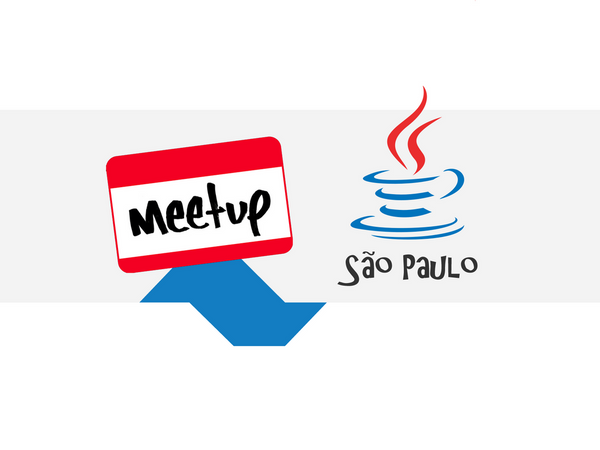

### Java Meetup São Paulo
 

## [Meetup](https://www.meetup.com/Sao-Paulo-Java-Meetup/)

Participe de nossas redes sociais!

## [LinkedIn](https://www.linkedin.com/company/java-meetup-sp/) 
 

## [Facebook](https://www.facebook.com/JavaMeetupSP) 
  

## [Twitter](https://twitter.com/JavaMeetupSampa)

E também: 

## [Telegram](https://t.me/JavaMeetupSPnews) - receba as novidades no seu celular!

## [Slack](https://javameetup.slack.com) - Converse com a gente! [(pegue seu convite para entrar aqui)](https://join.slack.com/t/javameetup/shared_invite/enQtMzE3MDIyNzczMjM2LTM0MzM5ZGNkODkzNjAxZjdmZjFkNWU2NTUzYmFiZjNhYjhjOTc3MjlmNzc0ZDZhYTg2ZmU0ODI2YjMyNGMyYzA)

## [YouTube](https://www.youtube.com/channel/UCjQtPPwMApg6mjEX-6wiXwA) - veja as nossas palestras

## [GitHub](https://github.com/meetupjavasaopaulo) - veja e contribua com nossos códigos

 
